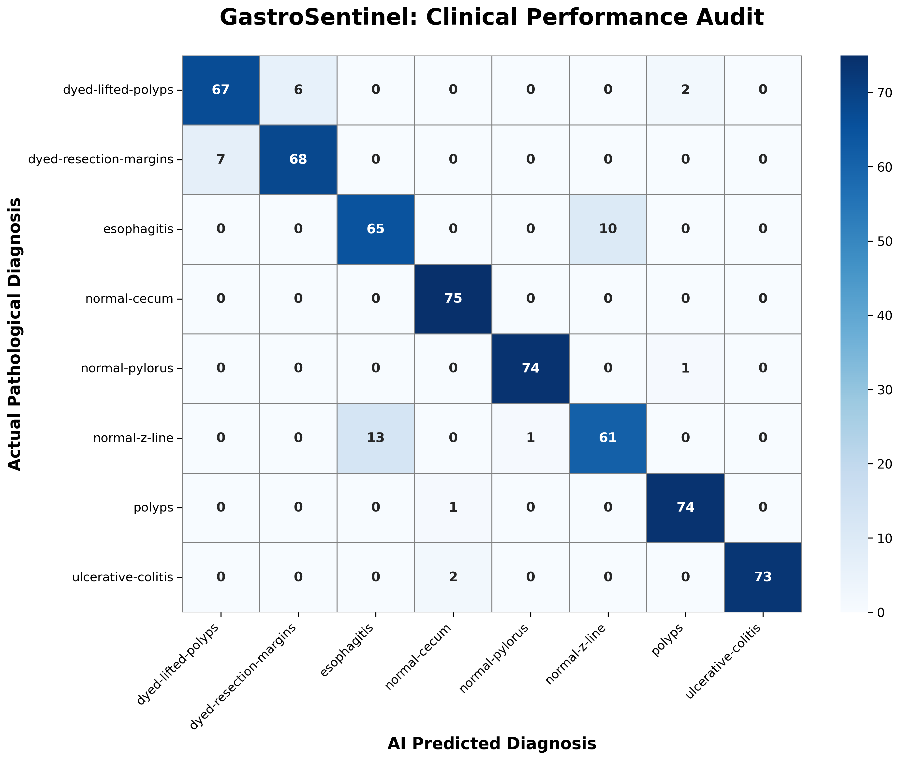
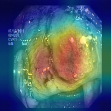
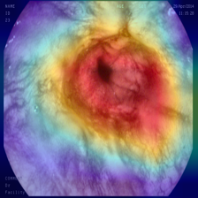
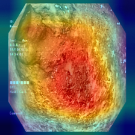

# 🏥 GastroSentinel: Clinical Decision Support System (CDSS)

## Uncertainty-Aware Multi-Model Diagnostic Engine for GI Endoscopy

---

## 📌 Executive Summary

**GastroSentinel** is a production-grade **Computer-Aided Diagnosis (CADx)** system designed for the automated detection and pathological localization of **8 gastrointestinal conditions**.

Unlike conventional image classifiers, this system is architected with a focus on **clinical safety** by utilizing a deep-feature concatenation backbone to identify subtle mucosal pattern variations.

The system bridges the **"Black-Box AI" gap** through **Grad-CAM++ explainability** 

---

# 📊 Comparative Clinical Audit (Ablation Study)

A rigorous comparative audit was conducted on three state-of-the-art deep learning architectures using the **Kvasir-V2 clinical dataset** to identify the safest model for clinical deployment.

---

## 1. Global Performance Summary

| Metric | DenseNet-121 (Primary) | ResNet-18 | EfficientNet-B0 |
|---|---:|---:|---:|
| Global Sensitivity | **92.83%** | 93.50% | 93.00% |
| Global Specificity | 98.98% | **99.03%** | 99.01% |
| Polyp Recall (Safety) | **98.67%** | 97.33% | 97.33% |
| Parameter Count | 7.0 Million | 11.2 Million | **5.3 Million** |

### Clinical Selection Rationale

Although **ResNet-18** achieved a slightly higher global average performance, **DenseNet-121** was selected as the production model because it achieved the highest sensitivity for **malignant polyps (98.67%)**.

In GI screening applications, minimizing **False Negatives** is the highest safety priority. DenseNet's dense connectivity structure preserves fine-grained mucosal texture information, improving early lesion detection capability.

---

# 2. Deep-Dive: Per-Class Sensitivity (Recall) Comparison

This analysis evaluates each model's ability to correctly identify clinical conditions.

| Clinical Class | DenseNet-121 | ResNet-18 | EfficientNet-B0 |
|---|---:|---:|---:|
| Polyps (Malignant Potential) | **98.67%** | 97.33% | 97.33% |
| Ulcerative Colitis | **97.33%** | 97.33% | 96.00% |
| Normal Pylorus (Landmark) | 98.67% | **100.00%** | 98.67% |
| Normal Cecum (Landmark) | **100.00%** | 98.67% | 97.33% |
| Dyed Resection Margins | 90.67% | 93.33% | **94.67%** |
| Dyed Lifted Polyps | 89.33% | **90.67%** | 89.33% |
| Esophagitis | **86.67%** | 84.00% | 84.00% |
| Normal Z-Line | 81.33% | **86.67%** | 86.67% |

---

## 📈 Clinical Evaluation Results

### Confusion Matrix



---

## 🔥 Grad-CAM++ Clinical Heatmaps

### Dyed Lifted Polyps




### Esophagitis




### Ulcerative Colitis



---

# 🌟 Key Technical Innovations

## 1. Mucosal Texture Enhancement (CLAHE)

Implemented **Contrast Limited Adaptive Histogram Equalization (CLAHE)** preprocessing to enhance:

- Vascular patterns
- Mucosal structures
- Subtle pit-texture variations

This improves visibility of early-stage gastrointestinal abnormalities.

---

## 2. Explainable AI (Grad-CAM++)

Integrated **Grad-CAM++ visualization** to generate pathological **Region of Interest (ROI)** heatmaps.

This provides:

- Transparent AI decision-making
- Spatial verification of model attention
- Reduced black-box behavior

Clinicians can verify whether the model focuses on relevant tissue morphology rather than imaging artifacts.


---

## 3. Real-Time Inference Performance

Optimized inference pipeline achieves:

- **<40ms GPU inference latency**
- Supports approximately **25-30 FPS**
- Designed for real-time endoscopic video analysis workflows

---

# 🛡️ Safety Guardrails & CDSS Logic

## Diagnostic Quality Filter

Automatically detects and rejects:

- Blurred frames
- Pitch-black images
- Low-quality inputs

to prevent unreliable predictions.

---

## Uncertainty-Aware Decision Support

The system provides confidence-based clinical recommendations:

- Confidence ≥ 90% → Diagnosis Accepted
- Confidence < 90% → **"Review Needed" Flag**

This ensures mandatory specialist verification for uncertain predictions.

---

## Automated Clinical Archiving

All generated outputs are automatically stored with timestamps:

```
results/
 ├── heatmaps/
 ├── metrics/
 └── predictions/
```

Supporting hospital quality assurance and model auditing.

---

# 🛠️ Tech Stack

| Category | Technologies |
|---|---|
| Deep Learning Engine | PyTorch |
| Computer Vision | OpenCV |
| Medical Imaging | Pydicom |
| Explainability | Grad-CAM++ |
| Visualization | Matplotlib |
| Clinical Dashboard | Streamlit |

---

#  Author

**Priyanka K**

Final Year Computer Science with Medical Engineering Student

Specialization: Artificial Intelligence & Data Analytics
